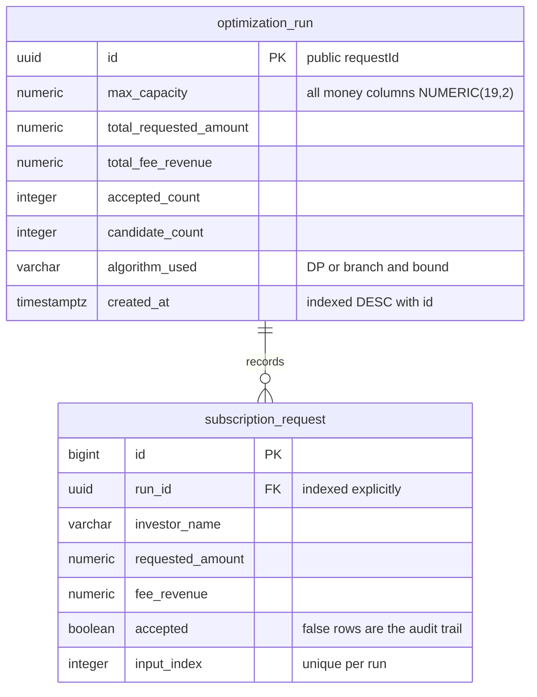
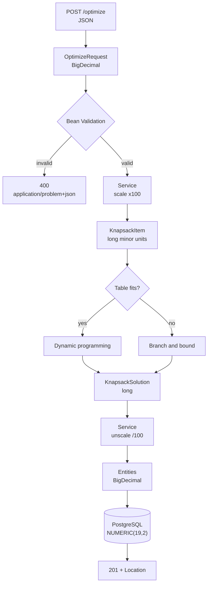

# Fund Subscription Capacity Allocator

A Spring Boot service that decides which investor subscription requests a fund should accept.
Given the capacity remaining in a funding window and a list of candidate requests, each with
an amount and the management fee it would earn, the service selects the combination that
maximises total fee revenue without exceeding the capacity. Requests cannot be partially
filled, so this is the 0/1 knapsack problem: amounts are weights, fees are values, and the
remaining capacity is the knapsack. Every run is persisted — accepted and declined candidates
alike — and can be read back or listed as an audit trail.

## Requirements

Java 21 and Docker. Nothing else: the Maven wrapper is committed, so no local Maven install is
needed.

Docker must be running for the build. `./mvnw clean package` runs the test suite, and the
integration tests start a PostgreSQL container through Testcontainers.

## Quick start

```
git clone https://github.com/djimon44/subscription-capacity.git
cd subscription-capacity
docker compose up -d
./mvnw clean package
java -jar target/subscription-capacity-0.0.1-SNAPSHOT.jar
```

The service listens on port 8080. The assignment's own example:

```
curl -X POST http://localhost:8080/api/v1/subscriptions/optimize \
  -H 'Content-Type: application/json' \
  -d '{
    "maxCapacity": 15,
    "availableSubscriptions": [
      {"investorName": "Investor A", "requestedAmount": 5,  "feeRevenue": 120},
      {"investorName": "Investor B", "requestedAmount": 10, "feeRevenue": 200},
      {"investorName": "Investor C", "requestedAmount": 3,  "feeRevenue": 80},
      {"investorName": "Investor D", "requestedAmount": 8,  "feeRevenue": 160}
    ]
  }'
```

On Windows, invoke `curl.exe` explicitly and pass the body from a file with `-d "@body.json"`.
PowerShell aliases `curl` to `Invoke-WebRequest`, which takes different arguments, and its
quoting rules mangle inline JSON.

## API

Three endpoints, all under `/api/v1/subscriptions`.

### POST /api/v1/subscriptions/optimize — 201 Created

Runs the allocation and persists it. The request above returns:

```json
{"requestId":"3691981f-d259-49be-834e-251e6171f5e3","acceptedSubscriptions":[{"investorName":"Investor A","requestedAmount":5.00,"feeRevenue":120.00},{"investorName":"Investor B","requestedAmount":10.00,"feeRevenue":200.00}],"totalRequestedAmount":15.00,"totalFeeRevenue":320.00,"createdAt":"2026-08-25T10:21:01.235Z"}
```

The response also carries a `Location` header pointing at the created resource
(`http://localhost:8080/api/v1/subscriptions/3691981f-d259-49be-834e-251e6171f5e3`), so a
client need not assemble the URL from the `requestId` itself.

A run in which nothing fits is a successful run, not an error. With `maxCapacity` 5 and a
single candidate requesting 50:

```json
{"requestId":"4eb02201-5432-4264-92c5-858fc38108ad","acceptedSubscriptions":[],"totalRequestedAmount":0.00,"totalFeeRevenue":0.00,"createdAt":"2026-08-25T10:24:53.097Z"}
```

Still 201, still persisted, with an empty list and zero totals. See
[Assumptions](#assumptions) for why this is a 201 rather than a 200.

### GET /api/v1/subscriptions/{requestId} — 200 OK

```
curl http://localhost:8080/api/v1/subscriptions/3691981f-d259-49be-834e-251e6171f5e3
```

Returns exactly the document the create returned — same fields, same values, same `createdAt`
down to the millisecond. This is not incidental: `readsBackExactlyWhatTheCreateReturned` in
`SubscriptionApiIntegrationTest` performs the POST, performs the GET, and asserts the two
responses are equal, with a second assertion on `createdAt` specifically. It exists because
two things could break it silently — a currency scale that survives serialisation but not a
round trip through `NUMERIC(19,2)`, and a timestamp whose precision differs between the JVM
clock and PostgreSQL's `TIMESTAMPTZ`. The injected `Clock` is truncated to milliseconds for
exactly that reason.

An unknown id returns 404.

### GET /api/v1/subscriptions — 200 OK

The audit trail, newest first:

```
curl 'http://localhost:8080/api/v1/subscriptions?size=10'
```

```json
{"content":[{"requestId":"4eb02201-5432-4264-92c5-858fc38108ad","maxCapacity":5.00,"totalRequestedAmount":0.00,"totalFeeRevenue":0.00,"candidateCount":1,"acceptedCount":0,"createdAt":"2026-08-25T10:24:53.097Z"},{"requestId":"d2efc546-f149-4cae-85f5-1489b0ad2157","maxCapacity":20.00,"totalRequestedAmount":20.00,"totalFeeRevenue":480.00,"candidateCount":2,"acceptedCount":2,"createdAt":"2026-08-25T10:24:52.992Z"},{"requestId":"3691981f-d259-49be-834e-251e6171f5e3","maxCapacity":15.00,"totalRequestedAmount":15.00,"totalFeeRevenue":320.00,"candidateCount":4,"acceptedCount":2,"createdAt":"2026-08-25T10:21:01.235Z"}],"page":0,"size":10,"totalElements":3,"totalPages":1}
```

`page` is zero-based and defaults to 0. `size` defaults to 20 and is capped at 100; a larger
value is silently reduced rather than rejected, which is Spring Data's
`spring.data.web.pageable.max-page-size` behaviour.

Ordering is fixed at newest first, by `createdAt` descending and then `id` descending. A
`sort` parameter is accepted — the standard pageable binding parses it — but it is discarded
before the query runs and has no effect. Forwarding it would be worse than ignoring it: the
repository query names its own ordering, so a recognised property would be silently ignored
anyway, while an unrecognised one would reach Spring Data and raise
`PropertyReferenceException`, turning a caller-supplied string into a 500.

Each entry reports both `candidateCount` and `acceptedCount`, so the listing answers "how
many applied, how many were funded" without touching the subscription rows.

The envelope is a project type rather than Spring's `Page`. Serialising `Page` directly emits
its internal `Pageable` and `Sort` structures, whose shape is an implementation detail and has
changed between Spring versions.

### Errors

Failures are RFC 9457 problem documents with content type `application/problem+json`. Each
carries a `type` URI naming the class of problem, so a client can distinguish a malformed
payload from a missing run without parsing prose.

A validation failure, 400:

```json
{"detail":"The request contains 1 invalid field(s)","instance":"/api/v1/subscriptions/optimize","status":400,"title":"Validation failed","type":"https://arcticblu.example/problems/validation-failed","errors":[{"field":"maxCapacity","message":"maxCapacity must not be negative"}]}
```

An unknown run, 404:

```json
{"detail":"No optimization run found with id 00000000-0000-0000-0000-000000000000","instance":"/api/v1/subscriptions/00000000-0000-0000-0000-000000000000","status":404,"title":"Optimization run not found","type":"https://arcticblu.example/problems/run-not-found"}
```

The `errors` array carries the array index for nested failures — a bad amount on the first
candidate reports the field as `availableSubscriptions[0].requestedAmount` — so a caller
sending several hundred candidates learns which one is wrong rather than only that something
is.

Spring's own dispatch failures keep their proper statuses: an unknown path returns 404, an
unsupported method 405, an unsupported content type 415, each with a problem body.
`GlobalExceptionHandler` extends `ResponseEntityExceptionHandler` for this. Handled by a
generic `@ExceptionHandler(Exception.class)` instead, all three would return 500 and log a
full stack trace at ERROR, which makes an unauthenticated request loop a log-flooding
primitive as well as a wrong answer.

## Database

`docker compose up -d` starts PostgreSQL 16 on `127.0.0.1:5432` with database
`subscription_capacity`.

The port is bound to loopback rather than `0.0.0.0`, so the container is reachable from the
host but not from the network the host is on — a Docker port publish otherwise bypasses the
host firewall. The credentials in `docker-compose.yml` are development defaults for a
disposable container; the application reads them through `${DB_USERNAME:arcticblu}` and
`${DB_PASSWORD:arcticblu}` placeholders in `application.yml`, so any other environment
overrides them by environment variable without a code change.

To inspect the data, and to reset:

```
docker exec -it arcticblu-postgres psql -U arcticblu -d subscription_capacity
docker compose down -v
```

`down -v` removes the named volume, so the next start replays the migrations against an empty
database.

## Schema design



Two tables, created by three Flyway migrations.

`optimization_run` holds the inputs and aggregate outputs of one run. `subscription_request`
holds one row per candidate in that run, accepted or not.

**`NUMERIC(19,2)` for every money column, never `float` or `double`.** Binary floating point
cannot represent 0.10 exactly, so a decimal amount is stored as the nearest binary
approximation and the error compounds across sums. An audit record whose totals do not equal
the sum of its rows is not an audit record. `NUMERIC` is exact decimal arithmetic, and the
scale of 2 matches the currency's minor unit.

**`TIMESTAMPTZ` rather than `TIMESTAMP`.** A bare `TIMESTAMP` records wall-clock digits with
no zone, so the same stored value denotes different instants depending on who reads it.
`TIMESTAMPTZ` stores an instant. For a record whose purpose is to say when a decision was
made, ambiguity is not acceptable. Hibernate is configured with `jdbc.time_zone: UTC` so the
JVM's default zone cannot leak into what is written.

**UUID primary key on `optimization_run`.** The id is the public `requestId` — it appears in
the `Location` header and in the read URL. A sequential integer would let a caller who
received one id enumerate every other run by decrementing it. The UUID is also assigned by the
application in the entity constructor rather than by the database, which lets the whole
aggregate be built in memory before a single statement is issued.

**Rejected candidates are stored alongside accepted ones.** This is the decision that shapes
the schema. An audit trail containing only the winners cannot answer why a particular investor
was not funded, cannot reproduce the run that produced the decision, and cannot evidence that
candidates were treated even-handedly — all three of which are the reason such a record exists
in a fund context. One table with an `accepted` flag captures the request and its outcome
together, without a second table or duplicated rows:

```
 investor_name | requested_amount | fee_revenue | accepted | input_index
---------------+------------------+-------------+----------+-------------
 Investor A    |             5.00 |      120.00 | t        |           0
 Investor B    |            10.00 |      200.00 | t        |           1
 Investor C    |             3.00 |       80.00 | f        |           2
 Investor D    |             8.00 |      160.00 | f        |           3
```

C and D are absent from the API response but present in the database. The API never exposes
them, so `persistsDeclinedCandidatesToo` goes around the API to the repository to assert they
landed.

**Denormalised totals and counts on `optimization_run`.** `total_requested_amount`,
`total_fee_revenue`, `accepted_count` and `candidate_count` are all derivable from the child
rows. They are stored because an audit record must preserve what the system reported at the
time it reported it. Recomputing them on read would rewrite history the moment the algorithm,
the tie-break rule, or the scaling changed. A run is written once and never updated, so there
is no drift to manage. It also means the listing endpoint answers entirely from one table — no
join, no per-row query.

**`input_index` preserves request order.** SQL guarantees no row ordering without an explicit
`ORDER BY`, so without a stored ordinal the round trip could return candidates in a different
order than they were submitted. It is also the join key back to the solver's item indices.

**Index on `(created_at DESC, id DESC)`.** This is exactly the listing's sort order, so
PostgreSQL walks the index rather than sorting the table. The `id` tiebreak makes the ordering
total: without it two runs sharing a timestamp could order inconsistently between two page
queries, so a row could appear on both pages or on neither.

**Explicit index on `subscription_request(run_id)`.** PostgreSQL indexes primary keys
automatically but **not** foreign keys. Without this index, fetching one run's subscriptions
scans the whole table, and so does the `ON DELETE CASCADE` when a run is deleted.

**`UNIQUE (run_id, input_index)`.** Two rows claiming the same position within one run is a
corrupt state, not merely unusual. PostgreSQL enforces this with an index on
`(run_id, input_index)`, whose leading column is `run_id` — so it partially overlaps the
single-column index above. The narrower index was kept because it serves the fetch-join path
at a smaller size; the redundancy is deliberate rather than overlooked.

**Check constraints in the database as well as in Java.** Non-negative amounts, non-negative
counts, and `accepted_count <= candidate_count`. The Java constructors enforce the same
invariants, but the database is the only layer that still applies when someone connects with
`psql`.

**Flyway owns the schema; Hibernate validates it.** `ddl-auto: validate` means an entity that
drifts from the migrations fails at startup with a named column, rather than at runtime with a
mystery, and Hibernate is never permitted to alter a table.

`algorithm_used` is `VARCHAR(32)`, and `KnapsackSolution` rejects an algorithm name longer
than 32 characters in its constructor, so the constraint is enforced before the value reaches
the persistence layer.

## Algorithm

### Why this is knapsack

Each candidate has a `requestedAmount` that consumes capacity and a `feeRevenue` earned only
if it is accepted. Capacity is a hard ceiling. A request cannot be partially filled, so each
candidate is either wholly in or wholly out. That is 0/1 knapsack exactly: amount is weight,
fee is value, `maxCapacity` is the knapsack, and the no-splitting rule is the 0/1 restriction.

### Why greedy fails

The assignment's own example is a counterexample. Value densities (fee per unit of capacity)
are:

| Investor | Amount | Fee | Density |
|---|---|---|---|
| C | 3 | 80 | 26.67 |
| A | 5 | 120 | 24.00 |
| D | 8 | 160 | 20.00 |
| B | 10 | 200 | 20.00 |

Taking greedily by density with a capacity of 15: C fits (12 left), A fits (7 left), then D
needs 8 and B needs 10, so neither fits. Greedy returns C and A for **200**, stranding 7 units
of capacity.

The optimum is A and B: 5 + 10 = 15, filling the window exactly for **320**. That is 60% more
fee revenue from the same candidates and the same capacity. Greedy is not slightly worse here;
it is worse in the exact scenario the assignment supplies. This is what motivates an exact
algorithm.

### Dynamic programming

The recurrence, over items 1..n and capacities 0..C:

```
best[i][c] = best[i-1][c]                                    if weight(i) > c
           = max( best[i-1][c],                              otherwise
                  value(i) + best[i-1][c - weight(i)] )
```

This runs in O(n × capacity) time and space. Note what that means: the cost scales with the
capacity *value*, not with the number of digits needed to write it. Doubling the capacity
doubles the work, but doubling the capacity adds only one bit to the input. The algorithm is
therefore pseudo-polynomial, not polynomial — fast for modest capacities and infeasible for
large ones.

The table is kept two-dimensional rather than collapsed to the usual rolling one-dimensional
array. The rolling form computes the optimal *value* in O(capacity) space, but it overwrites
the history needed to answer *which items were selected* — and the selection is the answer
this service returns. A parallel `taken[i][c]` table records the decision at each cell so the
selection can be reconstructed by walking backwards from `best[n][C]`.

### Why one algorithm is not enough

Amounts are scaled to integer minor units before they reach the solver, which multiplies the
table's width by 100. The ceiling is `max-table-cells: 10000000`, and three tables are
allocated per request — two `long[][]` at 8 bytes per cell and one `boolean[][]` at 1 byte, so
17 bytes per cell, roughly **170 MB** for a single request at the ceiling.

That ceiling admits a capacity of about `10,000,000 / (n + 1) - 1` minor units. For a dozen
candidates that is 769,229 minor units — a window of **7,692.29**. A realistic fund window is
larger than that, so dynamic programming alone would reject ordinary input with a
"problem too large" error. The ceiling is a deliberate trade rather than a safety margin:
raising it lets dynamic programming cover more requests, at the price of a larger worst-case
allocation for one request. Lowering it does the reverse.

### Branch and bound

The second solver is a depth-first search over accept/reject decisions, with candidates
ordered by descending value density so a strong incumbent is found early.

At each node an optimistic upper bound is computed by relaxing the problem to *fractional*
knapsack — allowing the last item to be split. The fractional problem is solvable greedily,
and its optimum is always at least the integral optimum, so the bound never underestimates.
Any subtree whose bound cannot improve on the incumbent is discarded without being explored.

The bound is computed in integer arithmetic and rounded **up**:

```java
try {
    // ceil(value * remaining / weight), computed without division loss.
    long numerator = Math.multiplyExact(item.value(), remaining);
    bound += Math.addExact(numerator, item.weight() - 1) / item.weight();
} catch (ArithmeticException overflow) {
    return Long.MAX_VALUE;
}
```

Floating point here would be a correctness bug, not a style choice. A bound that comes in even
slightly *low* prunes a subtree that could have held the true optimum — and does so silently,
returning a plausible suboptimal answer with no error. Rounding up can only make the bound
weaker, which costs time and never correctness. The same reasoning governs overflow: if the
product would exceed a `long`, the bound becomes `Long.MAX_VALUE` rather than throwing, since
an overestimate prunes nothing and is always safe.

Crucially, the cost of this search depends on the *number of candidates*, not on the magnitude
of the capacity. A capacity of 5,000,000,000 minor units — which has no allocatable DP table —
is no harder for it than a capacity of 15.

**One deliberate deviation from the textbook.** Pruning uses a strict comparison:

```java
if (upperBound(depth, value, weight) < bestValue) {
    return;
}
```

Textbook branch and bound prunes on `<=`, reasoning that a subtree which can only *match* the
incumbent adds nothing. That reasoning holds only when the optimum alone matters. Here ties on
value are broken further, by weight and then by item index, so a subtree that merely ties may
still contain the *preferred* selection. Pruning on `<=` discards it before it is examined —
no crash, no wrong optimum, just a different equally optimal subset. This one character is
where the cross-solver property test found a real defect; `TESTING.md` §4.4 has the account.

**The node limit.** Pruning is weakest when candidates share a value density, because the
fractional relaxation is then exact at every node and no bound ever falls below the incumbent.
That is not a contrived input — a flat percentage fee schedule produces it exactly, since a fee
proportional to the amount gives every candidate the same fee per unit of capacity. Without a
limit such an instance degenerates to enumerating all subsets: measured at 8 seconds for 32
candidates and still running after 25 seconds at 36, against a `@Size` limit that permits
1,000.

`DEFAULT_MAX_SEARCH_NODES = 5_000_000` bounds the node count, converting an unbounded search
into a fast, explicit rejection — the same instances now refuse in under a fifth of a second.
A node count was chosen over a wall-clock timeout because it is deterministic, and therefore
both reproducible across machines and testable. Requests with varied densities are unaffected:
1,000 candidates solve in milliseconds.

### Adaptive routing

`AdaptiveKnapsackSolver` asks one question per request — does this problem's DP table fit the
ceiling? — and routes to dynamic programming if so, branch and bound otherwise. A caller
therefore never sees a rejection merely because the capacity was large.

The fit check is written as a division, `capacity <= maxTableCells / rows - 1`, never a
multiplication, so no product can overflow while testing whether a product would be too big.

Both solvers return the same optimum under the same tie-breaking rules, so the routing affects
performance only, never the answer. Which one actually ran is recorded in the `algorithm_used`
column, because it varies per request.

### Tie-breaking

The rule is total, and stated on the `KnapsackSolver` interface:

1. Highest total fee revenue.
2. Among selections of equal revenue, the one consuming least capacity.
3. Among those, the one excluding the later-indexed candidate.

Identical input therefore always produces identical output. That is a requirement rather than
a nicety: the same request submitted twice must not record one investor as accepted on Monday
and declined on Tuesday.

### Cross-solver verification

Two property tests run 1,000 randomised problems each through both solvers and assert they
agree — one on totals, one on the selected subset itself. The dynamic programming solver is
itself first checked against exhaustive brute force, so there is never an argument about which
solver is wrong when they differ.

This caught a real defect. `selectsSameSubsetAsDynamicProgramming` failed on exactly one trial
in a thousand: the generated problem contained a candidate of **weight 0 and value 0**, which
either solver could include or exclude with identical totals. Both answers were optimal; only
the tie-break rule distinguished them. That difference is visible in the audit trail, since the
service writes an accepted-or-declined flag for every candidate.

The fix was to implement the full tie-break rule in branch and bound — including the strict
pruning comparison above — rather than to weaken the assertion to compare totals only or to
filter zero-value items out of the generator. Either of those would have made the suite green
in a minute and destroyed the only evidence that the two solvers disagreed about anything.

Nobody sits down to hand-write the case "a candidate applies for nothing and pays no fee, and
the tie is otherwise perfect". The defect lived in an input nobody would have chosen, and was
found because a thousand inputs were generated that nobody chose.

## Design decisions



**Money is `BigDecimal` at the boundaries and `long` minor units inside the algorithm — never
a floating point type anywhere.** The algorithm requires integers because weights index the DP
table directly. Currency is genuinely discrete at the minor unit, so the conversion loses
nothing: `MinorUnits` scales with `movePointRight`, which performs no rounding, and
`longValueExact`, which throws rather than truncating. Both directions are exact.

**Layering, with the dependency arrows pointing one way.** `web` depends on `service`;
`service` depends on `repository` and `algorithm`; nothing points back. The `algorithm` package
contains no Spring annotations at all — it is wired by an explicit `@Bean` method in
`AlgorithmConfiguration` — so the solvers are plain Java, unit-testable in milliseconds with no
container. The 68 tests in the `algorithm` package run in under half a second for that reason.

**DTOs separate from entities.** Three reasons, none of them ceremony: the JSON contract should
not be defined by the table structure, so a column rename is not a breaking API change; entities
carry internal fields (`inputIndex`, `isNew`, the back-reference to the run) that callers should
not see; and serialising a lazily loaded association after the persistence context has closed
throws, which with `open-in-view: false` is exactly what would happen.

**`OptimizationRun` implements `Persistable`.** Spring Data's `save()` decides between
`persist` and `merge` by asking whether the id is null. Because the UUID is assigned in the
constructor it never is, so every save would otherwise go through `merge` and issue a `SELECT`
looking for a row that cannot exist. The `isNew` flag is cleared by `@PostPersist`/`@PostLoad`.

**`optimize` is deliberately not `@Transactional`.** Scaling the amounts and running the search
touch no database at all, yet a method-level annotation would check a pooled connection out on
entry and hold it for the whole call. On a large problem the search takes noticeable time, so a
handful of concurrent optimisations would exhaust the connection pool while doing no database
work. The transaction is opened programmatically with a `TransactionTemplate` around the write
alone. Annotating a private helper instead would fail *silently*: a self-invocation never
passes through the proxy that applies the annotation, so the code would look transactional and
not be.

**Offset pagination via `page` and `size`.** Keyset pagination would be O(1) at any depth and
stable under concurrent inserts, and the `(created_at DESC, id DESC)` index already supports it.
Offset was chosen because it matches the conventional reading of "paginated results" and the
parameters a reviewer expects to be able to pass. The cost is documented under
[Known limitations](#known-limitations).

**The service returns web DTOs and accepts `Pageable`, which inverts the intended dependency
direction.** This is a considered trade, not an oversight: a parallel set of service-layer
result types, plus mappers in both directions, for three endpoints would be ceremony out of
proportion to the project. The cost is that a second delivery mechanism would have to either
reuse the web DTOs or force the refactor.

## Assumptions

Where the specification was ambiguous, this is what was decided and why.

**Status code for an empty result.** Constraint 1 specifies HTTP 200 when no combination fits,
while the endpoint list specifies 201 for the POST. These conflict. The constraint is read as
meaning that an empty result is a *successful run* rather than an error — which is the
substantive point — so the endpoint returns **201** with an empty list and zero totals, and
persists the run like any other. Returning 200 for that one case would be a one-line change in
`SubscriptionController.optimize`.

**Two decimal places.** Amounts are accepted to two decimal places and anything finer is
rejected with 400. The assignment's example uses whole numbers, but the fields are described as
currency amounts, and the solver requires an exact integer minor-unit representation.

**Precision is judged on the scale as written.** `@Digits(fraction = 2)` counts a value's
declared scale, so `5.100` is three decimal places and is rejected at the web layer even though
it denotes the same amount as `5.10`. The internal `MinorUnits` helper is more permissive — it
strips trailing zeros first, so `5.10` and `5.100` both scale to 510 minor units — but that
path is only reachable for a value the stricter web-layer check has already admitted. The net
API behaviour is the stricter of the two.

**At most 1,000 candidates per request**, enforced by `@Size(max = 1000)` on
`availableSubscriptions`.

**Investor names are labels, not identities.** They are validated as non-blank and at most 255
characters, and two candidates may share a name; nothing joins on them.

## Testing

120 tests across three tiers: pure unit tests over the algorithm and money conversion (no
Spring context), unit tests with Mockito over the service, and full-stack integration tests
running real HTTP against a real Spring context and a real PostgreSQL container started by
Testcontainers. The test container is pinned to `postgres:16-alpine`, the same tag
`docker-compose.yml` runs, so the suite validates against the database the application actually
uses.

The suite itself was validated by introducing bugs into the working tree one at a time —
swapped counts, a hardcoded algorithm name, a wrong scale factor. For each, the suite was run,
the failing tests were noted, and the change was reverted before the next one. Which tests did
*not* fail was recorded too, and was the more informative half: it is what shows where a
mutation slips past the tier that ought to catch it.

`TESTING.md` covers the detail: what each file pins, the randomised cross-checks, and the
design decisions behind the suite.

## Known limitations

- **Concurrency is not bounded.** A single request is bounded in both memory (the table
  ceiling) and search effort (the node limit), but nothing limits how many run at once. Enough
  concurrent large requests would still exhaust the heap.
- **`GenerationType.IDENTITY` prevents batched child inserts.** Hibernate must round-trip to
  obtain each generated id, so a run with 1,000 candidates issues 1,000 insert statements. A
  sequence with a pooled optimiser would allow batching, at the cost of a schema change.
- **No idempotency key.** A retried POST creates a second run recording the same decision.
- **The body is fully parsed before the 1,000-candidate limit applies**, and no maximum request
  size is configured, so an oversized payload is read into memory before it is rejected.
- **`@Digits` and `MinorUnits` disagree about trailing zeros.** `5.000` is rejected with 400
  although it denotes exactly `5.00`. The stricter layer runs first, so no incorrect value can
  reach the solver; the effect is a slightly narrower accepted input than intended.
- **Branch and bound's worst case is exponential.** The node limit converts it into a prompt
  rejection rather than a hang, but an instance past the limit cannot be solved exactly by this
  service. Raising the limit trades latency for reach; nothing here falls back to an
  approximation.
- **Deep offset pagination degrades**, because the database must scan and discard every
  preceding row. At the audit-trail volumes this service produces it is not a practical
  problem, but it is a real property of the choice.
- **The adaptive solver's fit check is duplicated**, once in `AdaptiveKnapsackSolver` and once
  in `DynamicProgrammingKnapsackSolver`. Both are tested at the same boundary values, but
  nothing fails if a future change updates one and not the other.
